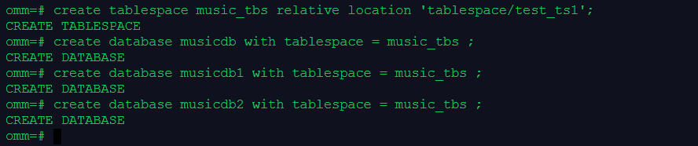
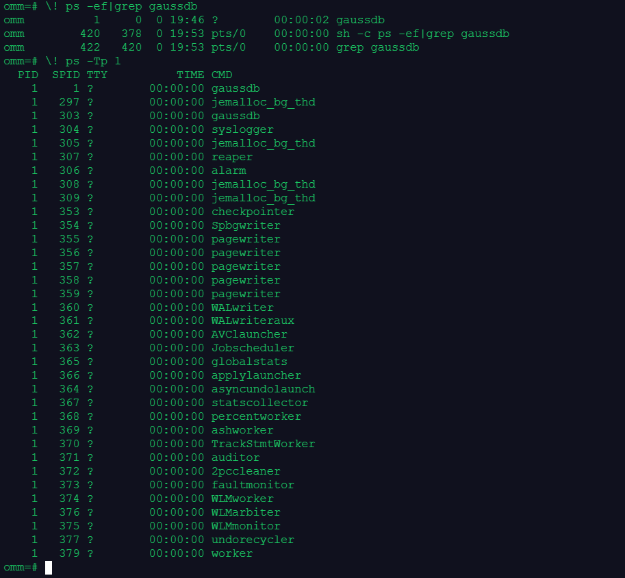

# openGauss每日一练第 3 天-实训作业

[文章地址](https://www.modb.pro/db/568044)
本文为第二届openGauss每日一练，21天打卡计划第三天的作业部分，课程内容总结如下[openGauss每日一练第 3 天-数据库状态查看](https://www.modb.pro/db/568042)

## 作业1
> 创建表空间music_tbs1和多个数据库music_db、music_db1、music_db2

```sql
CREATE TABLESPACE music_tbs RELATIVE LOCATION 'tablespace/test_ts1';
CREATE DATABASE musicdb  WITH TABLESPACE = music_tbs;
CREATE DATABASE musicdb1 WITH TABLESPACE = music_tbs;
CREATE DATABASE musicdb2 WITH TABLESPACE = music_tbs
```
  


## 作业2
> 查看数据库上的表空间
```
\db
```
  

可以看到实例中有初始的两个表空间pg_default 和 pg_global 还有我们刚刚创建的music_tbs


## 作业3
> 查看openGauss实例上有哪些数据库

```
\l
```
  
可以看到实例中有默认的postgres, template0, template, omm数据库和我们刚刚创建的musicdb, musicdb1, musicdb2数据库

## 作业4
> 使用操作系统命令，查看openGauss实例的进程、线程

```sql
--查看实例中的进程
\! ps -ef|grep gaussdb
--查看实例中的线程
\! ps -Tp 1
```
  


