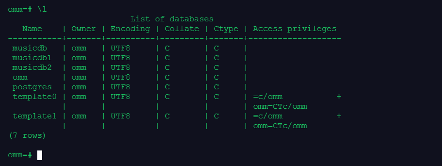

[文章地址](https://www.modb.pro/db/568206)

本文为第二届openGauss每日一练，21天打卡计划第四天的作业部分，课程内容总结如下[openGauss每日一练第 4 天-数据库状态查看](https://www.modb.pro/db/568204)

## 作业1
>创建用户user1、user2、user3，授予user1、user2、user3数据库系统的SYSADMIN权限

```sql
CREATE USER user1 WITH SYSADMIN password "kunpeng@1234";
CREATE USER user2 WITH SYSADMIN password "kunpeng@1234";
CREATE USER user3 WITH SYSADMIN password "kunpeng@1234";
```


## 作业2
> 分别使用user1、user2、user3访问数据库musicdb2，创建各自的表，并插入数据。表名和数据如下：
> 表名分别为： products1、 products2、 products3

| 字段名       | 数据类型 | 含义     |
| ------------ | -------- | -------- |
| product_id   | INTEGER  | 产品编号 |
| product_name | Char(20) | 产品名   |
| category     | Char(30) | 种类     |

向表中插入数据

<table>
<thead>
<tr>
<th>product_id</th>
<th>product_name</th>
<th>category</th>
</tr>
</thead>
<tbody>
<tr>
<td>1502</td>
<td>olympus camera</td>
<td>electrncs</td>
</tr>
<tr>
<td>1601</td>
<td>lamaze</td>
<td>toys</td>
</tr>
<tr>
<td>1700</td>
<td>wait interface</td>
<td>Books</td>
</tr>
<tr>
<td>1666</td>
<td>harry potter</td>
<td>toys</td>
</tr>
</tbody>
</table>

```sql
\c musicdb user1
create table products1 (product_id integer, product_name char(20), category char(30));
insert into products1 values(1502, 'olympus camera', 'electrncs');
\c musicdb user2
create table products2 (product_id integer, product_name char(20), category char(30));
insert into products2 values(1601, 'lamaze', 'toys');
\c musicdb user3
create table products3 (product_id integer, product_name char(20), category char(30));
insert into products3 values(1700, 'wait interface', 'Books');
insert into products3 values(1666, 'harry potter', 'toys');
```


## 作业3
> 使用user1、user2、user3用户中的任何一个，查看当前数据库musicdb有哪些表

```
\dt
```
  
可以看到数据库中有products1, products2, products3三个表，分别属于user1, user2, user3


