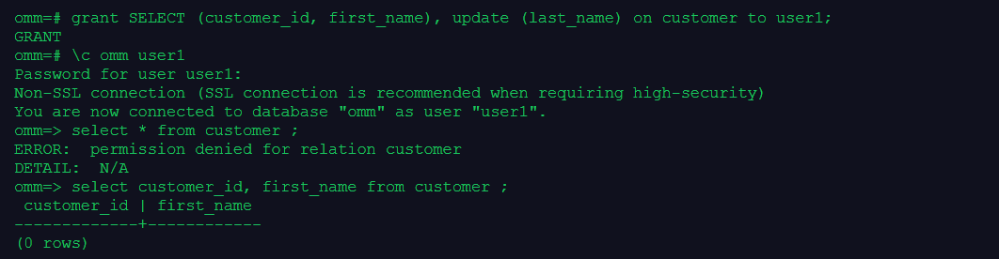

# [openGauss每日一练第 5 天-一个用户可以访问多个数据库](https://www.modb.pro/db/568584)

## 1. 用户权限
[参考文档](https://docs.opengauss.org/zh/docs/3.1.0-lite/docs/Developerguide/%E7%AE%A1%E7%90%86%E7%94%A8%E6%88%B7%E5%8F%8A%E6%9D%83%E9%99%90.html)

* 权限
    数据库对象创建后，进行对象创建的用户就是该对象的所有者。数据库安装后的默认情况下，未开启三权分立，**数据库系统管理员具有与对象所有者相同的权限**也就是说对象创建后，默认只有对象所有者或者系统管理员可以查询、修改和销毁对象，以及通过`GRANT`将对象的权限授予其他用户。

    为使其他用户能够使用对象，必须向用户或包含该用户的角色授予必要的权限。

* 撤销权限
  要撤消已经授予的权限，可以使用`REVOKE`。对象所有者的权限（例如ALTER、 DROP、COMMENT、INDEX、VACUUM、GRANT和REVOKE）是隐式拥有的，即只要拥有对象就可以执行对象所有者的这些隐式权限。对象所有者可以撤消自己的普通权限，例如，使表对自己以及其他人只读，系统管理员用户除外。 

## 2. 用户权限实例

* 将系统权限授权给用户或角色
创建名为user2的用户，并将sysadmin权限授权给他。
```
create user user2 password 'kunpeng@1234';
GRANT ALL PRIVILEGES TO user2;
```


* 将对象权限授权给用户或者角色。

1. 创建模式test以及表customer。
```
CREATE SCHEMA test;
 CREATE TABLE customer
(
    c_customer_sk             integer,
    c_customer_id             char(5),
    c_first_name              char(6),
    c_last_name               char(8),
    Amount                    integer
);
```

2. 撤销user2用户的sysadmin权限，然后将模式test的使用权限和表customer的所有权限授权给用户user2。( 将模式中的表或者视图对象授权给其他用户时，需要将表或视图所属的模式的USAGE权限同时授予该用户，若没有该权限，则只能看到这些对象的名称，并不能实际进行对象访问。)
```
REVOKE ALL PRIVILEGES FROM user2;
GRANT USAGE ON SCHEMA test TO user2;
GRANT ALL PRIVILEGES ON customer TO user2;
```


3. 将表customer中c_customer_sk、c_customer_id、c_first_name列的查询权限，c_last_name的更新权限授权给user2。
```
GRANT select (c_customer_sk,c_customer_id,c_first_name),update (c_last_name) ON customer TO user2;
```
  


1. 将数据库musicdb的连接权限授权给用户user1，并给予其在musicdb中创建schema的权限，而且**允许user2将此权限授权给其他用户**(加上with grant option)。
```
create table t1(col char(20));
\c omm omm 
GRANT create,connect on database musicdb TO user1 WITH GRANT OPTION;
\c musicdb user1
create table t1(col char(20));
CREATE ROLE test_manager PASSWORD 'xxxxxxxx';
GRANT USAGE,CREATE ON SCHEMA test TO test_manager;
```

5.创建表空间tpcds_tbspc，并将表空间的所有权限授权给用户joe，但用户joe无法将权限继续授予其他用户。
```
CREATE TABLESPACE tpcds_tbspc RELATIVE LOCATION 'tablespace/tablespace_1';
GRANT ALL ON TABLESPACE tpcds_tbspc TO joe;
```

* 将用户或者角色的权限授权给其他用户或角色。

1.创建角色manager，将user2的权限授权给manager，并允许该角色将权限授权给其他人(with admin option)。
```
CREATE ROLE manager PASSWORD 'xxxxxxxx';
GRANT user2 TO manager WITH ADMIN OPTION;
```
2.创建用户senior_manager，将用户manager的权限授权给该用户。
```
CREATE ROLE senior_manager PASSWORD 'xxxxxxxx';
GRANT manager TO senior_manager;
```


