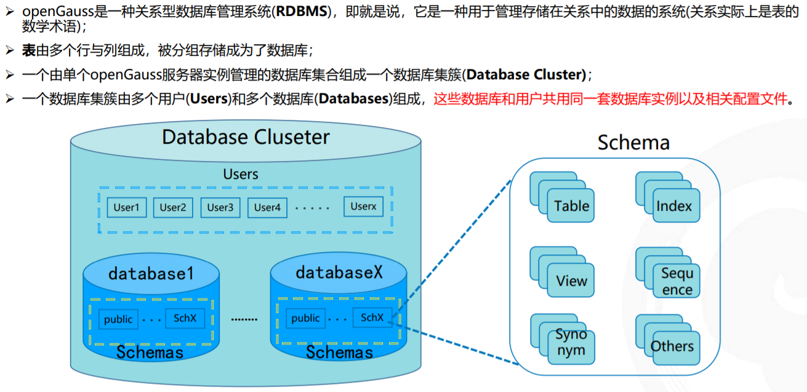
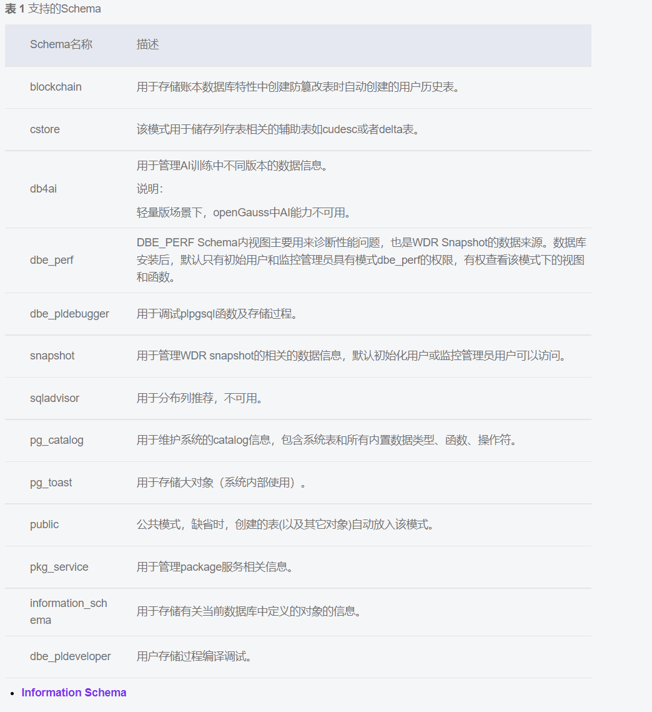

# [openGauss每日一练第 7 天-用户和模式](https://www.modb.pro/db/569936)

## 1. 模式的定义
[参考文档](https://docs.opengauss.org/zh/docs/3.1.0-lite/docs/Developerguide/Schema.html)
### 1.定义
Schema又称作模式。通过管理Schema，允许多个用户使用同一数据库而不相互干扰，可以将数据库对象组织成易于管理的逻辑组，同时便于将第三方应用添加到相应的Schema下而不引起冲突。

**每个数据库包含一个或多个Schema。数据库中的每个Schema包含表和其他类型的对象。**
> 可以把schema看作对一个数据库的分割，每个用户如果不授权的话只能在自己的schema下创建对象，也不能访问其他人schema下的对象


### 2.public模式
数据库创建初始，默认具有一个名为**public**的Schema，且所有用户都拥有此Schema的usage权限，**只有系统管理员和初始化用户可以在public Schema下创建函数、存储过程和同义词对象**，其他用户即使赋予create权限后也不可以创建上述三种对象。Schema类似于操作系统目录，但Schema不能嵌套。默认只有初始化用户可以在pg_catalog模式下创建对象。
**这就解释了我昨天在创建一个新用户后，没有给予它管理员权限，它就不可以在public模式下创建对象**


### 3.同名对象与模式
相同的数据库对象名称可以应用在同一数据库的不同Schema中，而没有冲突。例如，a_schema和b_schema都可以包含名为mytable的表。具有所需权限的用户可以访问数据库的多个Schema中的对象。

DatabaseName.SchemaName.TableName或者SchemaName.TableName，来访问某个模式下的一个表。

## 2. 搜索路径
搜索路径定义在search_path参数中，参数取值形式为采用逗号分隔的Schema名称列表。如果创建对象时未指定目标Schema，则该对象会被添加到搜索路径中列出的第一个Schema中。当不同Schema中存在同名的对象时，查询对象未指定Schema的情况下，将从搜索路径中**包含该对象的第一个Schema**中返回对象

  

search_path参数的默认值为：`"\$user",public`。\$user表示与当前会话用户名同名的Schema名，如果这样的模式不存在，$user将被忽略。所以默认情况下，**用户连接数据库后，如果数据库下存在同名Schema，则对象会添加到同名Schema下，否则对象被添加到Public Schema下。**

## 3.创建数据库内含的schema
[官方文档](https://docs.opengauss.org/zh/docs/3.1.0-lite/docs/Developerguide/Schema-24.html)，用的时候去查

  

### information_schema
信息模式本身是一个名为information_schema的模式。这个模式自动存在于所有数据库中。**信息模式由一组视图构成**，它们包含定义在当前数据库中对象的信息。这个模式的拥有者是初始数据库用户，并且该用户自然地拥有这个模式上的所有特权，包括删除它的能力。
#### 常见视图
- [schemata](https://www.postgresql.org/docs/9.2/infoschema-schemata.html)
  存储了当前数据库的所有schema，常用的属性有
  - catalog_name: schema属于的数据库名称，一般是当前数据库
  - schema_name: schema的name
  - schema_owner: schema的owner
  
- [tables](https://www.postgresql.org/docs/9.2/infoschema-tables.html)
  当前用户可见的所有表和视图
  - table_catalog：table属于的数据库名称，一般是当前数据库
  - table_schema
  - table_name
  - table_type：表的类型 BASE TABLE(普通表), VIEW(视图), FOREIGN TABLE(外表), LOCAL TEMPORARY(临时表)

## 4.每日sql语句
```sql
create or replace view my_tables as 
select table_catalog, table_schema, table_name, table_type
from information_schema.tables
where table_schema not in ('pg_catalog', 'information_schema','dbe_perf');
```
创建视图，类似于一个查询，只不过将查询的结果存储到一个表中了

```sql
show search_path;
set search_path to user1,public;
```
展示搜索路径与设置搜索路径