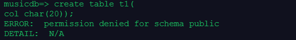

# [openGauss每日一练第 6 天-用户与数据库](https://www.modb.pro/db/569674)

由于昨天已经覆盖了今天的内容，所以学一下新的知识

## 1. 用户权限
[参考文档](https://docs.opengauss.org/zh/docs/3.1.0-lite/docs/Developerguide/%E7%AE%A1%E7%90%86%E7%94%A8%E6%88%B7%E5%8F%8A%E6%9D%83%E9%99%90.html)

有一个问题一直没解决，那就是我在omm数据库用omm账号创建一个数据库musicdb后，然后创建一个用户user1，尝试了许多方法使user1去访问musicdb但都不行，只有将其设为管理员可以
尝试的方法
- `grant connect,create on database musicdb to user1;`
- `grant usage schema public to user1;`
- 在musicdb中, `set search_path to user1,public;`
但都会报如下错误
  


## 2. 表空间，模式，数据库的关系
- 三者之间的关系
    - 表空间是一个存储区域，在一个表空间中可以存储多个数据库
    - 数据库是被模式来切分的，一个数据库至少有一个模式，所有数据库内部的对象(object)是被创建于模式的
    - 在管理员创建一个具体数据库后，应该为所有可以连接到该数据库的用户分别创建一个与用户名相同的模式
    - 用户默认只能访问对应的模式，如要访问其它模式，则需要通过授权语句完成

- 创建一个数据库的流程
1. 先创建一个用户user1
```
create user user1 IDENTIFIED BY 'kunpeng@1234';
```
2. 创建一个表空间
```
create tablespace musictb  RELATIVE LOCATION  'tablespace/tablespqce_1';
```
3. 创建一个数据库,并指明表空间和owner
```
create database musicdb with tablespace = musictb owner user1;
```
4. 用user1连接到新数据库中，并创建模式，指明模式的所属者
```
\c musicdb user1
CREATE SCHEMA user1 AUTHORIZATION user1;
```
5. 设置搜索路径，将新的模式添加到上面
```
SET SEARCH_PATH TO user1,public;
```