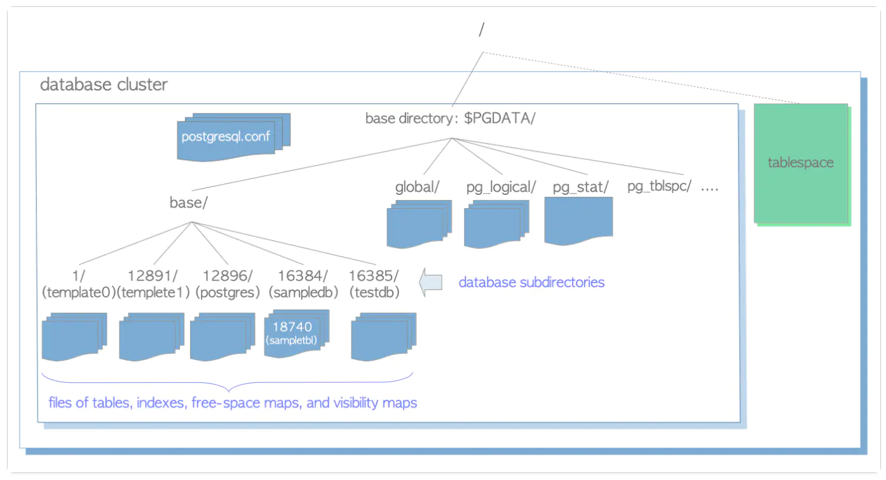

# [openGauss每日一练第3天-表空间及相关操作](https://www.modb.pro/db/568042)

## 1. 表空间 
* 一个表空间是一个**存储位置**，其中底层的基础数据库的对象可以保留。它在物理和逻辑数据之间提供了一个抽象层 并用于所有DBMS管理的段分配储存。 创建后，可以在创建数据库段时按名称引用表空间。
* 表空间仅指定数据库的储存位置，不指定数据库结构或数据库架构。 例如，同一模式中的不同对象可能具有不同的基础表空间。类似的，表空间可以为多个模式提供服务。有时，它可以用于指定模式，以便于在逻辑和物理数据层形成联系。
* openGauss自带了两个表空间：pg_default和pg_global。
  * 默认表空间pg_default：用来存储非共享系统表、用户表、用户表index、临时表、临时表index、内部临时表的默认表空间。对应存储目录为实例数据目录下的base目录。
  * 共享表空间pg_global：用来存放共享系统表的表空间。对应存储目录为实例数据目录下的global目录。

## 2. 实例，集簇或服务
数据库集簇是openGauss服务管理的数据库的集合，数据库是数据库对象的集合，数据库对象包括了表，索引，视图，函数，序列等等。
**我的理解：数据库集簇就是为了对应以一个特定服务，业务，系统做的一整套数据库的规范性集合，包括一些环境变量，一些配置信息，一些数据库，我们实验所用的系统就可以看作一个大的集簇，之前一直在默认数据库操作，现在可以创建表空间，在表空间里创建数据库了**
  
gs_initdb初始化新的数据库集簇，**PGDATA环境变量指定了数据库集簇的目录** ，其中base目录下的子目录是数据库的目录，配置相关信息在postgresql.conf文件中，还有一些系统表相关的目录及表空间相关的目录。
数据库对象目录及文件名关联数据库对象的OID，如数据库目录名关联数据库的OID。
**表空间创建成功后，在数据库集簇初始化目录下的pg_tblspc会创建一个软链接，链接到表空间的真实目录。**

## 3. 在数据库中查看进程，线程
```
\! ps -ef|grep gaussdb
\! ps -Tp 1
```
> 相比于命令行，在数据库中要执行命令行语句只需加一个\!即可


## 4. 每日一个sql语句
`CREATE TABLESPACE music_tbs RELATIVE LOCATION 'tablespace/test_ts1';`
> 创建一个表空间并利用关键字链接到'tablespace/test_ts1'上


`CREATE DATABASE musicdb  WITH TABLESPACE = music_tbs;` 
> 创建数据库，并指定表空间

